# Hearth — Data Model ERD (US-E3-01)

> Status: **APPROVED** — human-signed-off 2026-06-12. Schema built in US-E3-02 (Alembic migrations + pgvector). See §6/§7 for the rulings applied.
> Owner: Sable (Database). Day 4 · 2026-06-12. Branch: `integration/data`.
> Scope source: the 11 plan entities + whatever the 17 `J-*` journeys (`docs/qa/qa-matrix.md`) and the 7 hi-fi screens (`docs/brand/preview/screens/`) clearly require.
> Conventions: see §3. All formerly **[PROPOSED]** entities (sessions, conversations, messages, agent_actions) were **KEPT** by human ruling; `reviews` + `payments` were **ADDED**.

---

## 1. ERD (Mermaid)

```mermaid
erDiagram
    USERS ||--o{ ADDRESSES        : has
    USERS ||--o{ SESSIONS         : has
    USERS ||--o| STORES           : "owns (seller)"
    USERS ||--o{ CARTS            : owns
    USERS ||--o{ ORDERS           : places
    USERS ||--o{ CONVERSATIONS    : starts

    STORES ||--o{ PRODUCTS        : sells
    STORES ||--o{ POLICIES        : publishes

    PRODUCTS ||--o{ VARIANTS      : "has (>=1)"
    PRODUCTS ||--o{ PRODUCT_IMAGES : has
    PRODUCTS ||--o{ REVIEWS        : "rated by"
    USERS    ||--o{ REVIEWS        : writes
    VARIANTS ||--|| INVENTORY      : "stock-tracked by"
    VARIANTS ||--o{ CART_ITEMS     : "added as"
    VARIANTS ||--o{ ORDER_ITEMS    : "purchased as"

    CARTS ||--o{ CART_ITEMS        : contains
    CARTS ||--o| ORDERS            : "checks out into"

    ORDERS ||--|{ ORDER_ITEMS      : "contains (>=1)"
    ORDERS ||--o{ PAYMENTS         : "paid by"
    ORDERS ||--o{ RETURNS          : "may have"
    ORDERS ||--o| ADDRESSES        : "ships to (snapshot)"

    ORDER_ITEMS ||--o{ RETURN_ITEMS : "returned via"
    RETURNS ||--|{ RETURN_ITEMS     : "covers (>=1)"

    USERS ||--o{ AGENT_ACTIONS      : "subject of"
    CONVERSATIONS ||--o{ MESSAGES   : contains
    CONVERSATIONS ||--o{ AGENT_ACTIONS : "logs"

    PRODUCTS     ||--o{ EMBEDDINGS  : "embedded as (polymorphic)"
    POLICIES     ||--o{ EMBEDDINGS  : "embedded as (polymorphic)"

    USERS {
        uuid   id PK
        text   email UK
        text   password_hash "null if OAuth/guest-promoted"
        text   display_name
        text   role "buyer|seller|support|admin (enum)"
        bool   is_active
        timestamptz created_at
        timestamptz updated_at
        timestamptz deleted_at "soft delete, nullable"
    }

    SESSIONS {
        uuid   id PK
        uuid   user_id FK "nullable for guest session"
        text   token_hash UK
        timestamptz expires_at
        timestamptz created_at
    }

    ADDRESSES {
        uuid   id PK
        uuid   user_id FK "nullable: order-snapshot copy has none"
        text   recipient_name
        text   line1
        text   line2 "nullable"
        text   city
        text   region
        text   postal_code
        text   country_code "ISO-3166-1 alpha-2"
        bool   is_default
        timestamptz created_at
    }

    STORES {
        uuid   id PK
        uuid   owner_id FK "-> users.id (seller)"
        text   name
        text   slug UK
        text   location "e.g. 'Bristol, UK'"
        text   bio "maker blurb"
        text   status "draft|active|suspended (enum)"
        int    payout_pct "maker keeps N% (e.g. 88)"
        timestamptz created_at
        timestamptz updated_at
    }

    PRODUCTS {
        uuid   id PK
        uuid   store_id FK
        text   title
        text   slug UK
        text   description "long; embedded for RAG"
        text   category
        jsonb  attributes "care/materials, oven-safe?, etc."
        text   status "draft|active|archived (enum)"
        numeric rating_avg "DERIVED rollup of reviews; nullable; recompute on review write"
        int    rating_count "DERIVED rollup of reviews"
        timestamptz created_at
        timestamptz updated_at
        timestamptz deleted_at "soft delete"
    }

    PRODUCT_IMAGES {
        uuid   id PK
        uuid   product_id FK
        uuid   variant_id FK "nullable: variant-specific shot"
        text   url
        text   alt "accessibility (A8)"
        int    position
    }

    REVIEWS {
        uuid   id PK
        uuid   product_id FK
        uuid   user_id FK
        smallint rating "1-5 (CHECK)"
        text   title "nullable"
        text   body
        timestamptz created_at
    }

    VARIANTS {
        uuid   id PK
        uuid   product_id FK
        text   sku UK
        jsonb  options "{glaze:'Deep moss', size:'Large 28cm'}"
        bigint price_minor "minor units; per-variant price"
        text   currency "ISO-4217, default 'USD'"
        bool   is_active
        timestamptz created_at
        timestamptz updated_at
    }

    INVENTORY {
        uuid   id PK
        uuid   variant_id FK "UNIQUE; 1:1 with variant"
        int    qty_on_hand
        int    qty_reserved "held by open carts/pending orders"
        int    restock_eta_days "nullable; powers 'ships in 2-3 days'"
        timestamptz updated_at
    }

    CARTS {
        uuid   id PK
        uuid   user_id FK "nullable -> guest cart"
        text   anon_token "nullable; guest cart handle"
        text   status "open|converted|abandoned (enum)"
        timestamptz created_at
        timestamptz updated_at
    }

    CART_ITEMS {
        uuid   id PK
        uuid   cart_id FK
        uuid   variant_id FK
        int    qty
        timestamptz added_at
    }

    ORDERS {
        uuid   id PK
        text   order_number UK "human ref e.g. HRT-2381"
        uuid   user_id FK
        uuid   cart_id FK "nullable; source cart"
        text   status "placed|packed|shipped|delivered|cancelled (enum)"
        bigint subtotal_minor
        bigint shipping_minor
        bigint tax_minor
        bigint total_minor
        text   currency
        jsonb  ship_address "snapshot copy at purchase"
        timestamptz placed_at
        timestamptz updated_at
    }

    ORDER_ITEMS {
        uuid   id PK
        uuid   order_id FK
        uuid   variant_id FK "ref only; nullable on later delete"
        text   title_snapshot "product title at purchase"
        jsonb  options_snapshot "variant options at purchase"
        text   store_name_snapshot
        bigint unit_price_minor "price at purchase"
        int    qty
        text   fulfil_status "pending|fulfilled|cancelled (enum)"
    }

    PAYMENTS {
        uuid   id PK
        uuid   order_id FK
        text   status "pending|authorized|captured|failed|refunded (enum)"
        text   provider_ref "test-mode provider/charge id"
        bigint amount_minor
        text   currency "ISO-4217"
        timestamptz created_at
    }

    RETURNS {
        uuid   id PK
        uuid   order_id FK
        text   status "requested|approved|rejected|hitl_pending|refunded (enum)"
        text   reason_code "see §4 return-reasons enum"
        text   note "free text from buyer"
        bool   within_window "30-day check result"
        uuid   approved_by FK "nullable -> users.id (HITL human)"
        timestamptz created_at
        timestamptz resolved_at "nullable"
    }

    RETURN_ITEMS {
        uuid   id PK
        uuid   return_id FK
        uuid   order_item_id FK
        int    qty
    }

    POLICIES {
        uuid   id PK
        uuid   store_id FK "nullable -> platform-wide policy"
        text   kind "returns|shipping|payments|care|platform (enum)"
        text   title
        text   body "markdown; the RAG source text"
        bool   is_active
        int    version
        timestamptz effective_from
        timestamptz updated_at
    }

    CONVERSATIONS {
        uuid   id PK
        uuid   user_id FK "nullable -> anon"
        text   surface "buyer|support|seller (enum)"
        uuid   context_order_id FK "nullable; grounding ref"
        uuid   context_product_id FK "nullable; grounding ref"
        timestamptz created_at
    }

    MESSAGES {
        uuid   id PK
        uuid   conversation_id FK
        text   role "user|assistant|system|tool (enum)"
        text   content
        jsonb  citations "retrieved source refs shown in UI"
        timestamptz created_at
    }

    AGENT_ACTIONS {
        uuid   id PK
        uuid   conversation_id FK "nullable"
        uuid   actor_user_id FK "nullable; human who confirmed"
        text   action_type "recommend|add_to_cart|start_return|accept_nudge|publish|escalate|guardrail_change"
        jsonb  payload "what was done"
        text   outcome "applied|refused|hitl_deferred (enum)"
        timestamptz created_at
    }

    EMBEDDINGS {
        uuid   id PK
        text   source_type "product|policy (enum, polymorphic)"
        uuid   source_id "-> products.id or policies.id"
        text   chunk_text "the embedded text chunk"
        int    chunk_index
        vector embedding "pgvector; dim configurable (see §5)"
        text   model "provider+model that produced it"
        timestamptz created_at
    }
```

---

## 2. Entity dictionary

- **users** — every account across the 4 personas; `role` enum (buyer/seller/support/admin) drives authz. Soft-deletable. Sellers also own a `stores` row.
- **sessions** — auth/session persistence (**KEPT** per ruling); nullable `user_id` lets a guest session carry a cart before login.
- **addresses** — shipping/billing addresses owned by a user; the *order's* shipping address is snapshotted into `orders.ship_address` (jsonb) so editing the saved address never rewrites past orders.
- **stores** — the maker/seller storefront (screens say "Field & Kiln · Bristol, UK", "Maker keeps 88%"). Holds payout %, status, bio. One per seller (1:1 with a seller user for v0).
- **products** — catalog item; long `description` + `attributes` jsonb are the RAG embed source. `rating_avg`/`rating_count` are **DERIVED rollups of `reviews`** (recompute app-side on review write for v0); kept on the row so list cards don't aggregate per render.
- **product_images** — gallery shots; carries `alt` for A8 accessibility; optional `variant_id` for per-variant photos.
- **reviews** — real buyer reviews (**ADDED** per ruling; was deferred in the draft). `rating` smallint 1–5 (CHECK), nullable `title`, `body`. UNIQUE `(product_id, user_id)` prevents duplicate reviews. Source of truth behind the denormalized `products.rating_avg`/`rating_count` ("4.8 · 64 reviews" on the product screen).
- **variants** — the buyable unit (glaze × size on the product screen). **Price + SKU live here**, not on products (see Decision A). `options` jsonb keeps variant axes flexible without an EAV table.
- **inventory** — 1:1 with variant; `qty_on_hand` − `qty_reserved` = sellable; `restock_eta_days` powers "ships in 2–3 days". Separate table so stock writes don't churn the variant row or its embeddings.
- **carts** — one *open* cart per user (partial-unique on `user_id WHERE status='open'`); nullable `user_id` + `anon_token` supports guest carts (Decision B).
- **cart_items** — variant + qty in a cart. Live price/title come from the joined variant (not snapshotted — cart reflects current price).
- **orders** — checkout result; `order_number` is the human ref (HRT-2381). Money totals as minor-unit bigints; shipping address snapshotted as jsonb. Status enum matches the order-status timeline (placed→packed→shipped→delivered).
- **order_items** — **snapshots** title/options/store-name/unit-price at purchase time (Decision C) so later catalog edits never alter order history. Per-line `fulfil_status` supports partial fulfilment (`J-SEL-05`).
- **payments** — minimal, **test-mode only** (**ADDED** per ruling). One row per order: `status` enum, `provider_ref` (test charge id), `amount_minor` + `currency`. No real PSP integration in v0; the agent never moves real money.
- **returns** — per-order return request; `reason_code` enum, `within_window` records the 30-day check, `hitl_pending` status + `approved_by` capture the human-in-the-loop deferral (`J-BUY-06`, order-status screen).
- **return_items** — which order lines (and qty) a return covers, so partial returns work (Decision D).
- **policies** — returns/shipping/care/platform text; `body` markdown is a **RAG source** alongside product descriptions. Versioned + `is_active` so an admin guardrail/policy edit is observable (`J-ADM-02`); nullable `store_id` = platform-wide vs per-store policy.
- **conversations / messages** — agent chat persistence (**KEPT** per ruling); `citations` jsonb on a message backs the grounded-citation UI ("Field & Kiln · care & materials").
- **agent_actions** — the audit log the QA matrix demands (**KEPT** per ruling: "every agent action is logged and traceable", `J-SUP-03`, `J-SEL-04` publish-audit, `J-ADM-02/03`). `outcome` captures applied / refused / HITL-deferred.
- **embeddings** — single polymorphic pgvector table (`source_type` + `source_id`) for product and policy chunks (Decision F). One table = one index, one regen path Sable+Echo share.

---

## 3. Conventions (recommended)

- **IDs — UUID v7 (recommended).** Rationale: no cross-service sequence coordination (managed Neon/Supabase + local), non-enumerable in URLs/APIs (a buyer can't guess order ids — ties to `J-SUP-01` "no fabrication" + privacy), and Echo/agent tools pass ids around freely. v7 keeps them time-ordered so index locality ≈ bigint. Human-facing refs (`order_number` HRT-2381, `sku`, `slug`) are separate readable columns — UUIDs never appear in the UI.
- **Money — integer minor units (`bigint`, e.g. cents).** Rationale: avoids float rounding entirely; `numeric` also works but minor-unit ints are unambiguous in JSON/Pydantic and match how the test-mode payment layer will think. Every money column is `*_minor` + a sibling `currency` (ISO-4217). v0 is USD-only but the column keeps us honest.
- **Timestamps — `timestamptz`, UTC.** `created_at` everywhere; `updated_at` where rows mutate.
- **Soft delete — `deleted_at timestamptz NULL`** on user-facing catalog/account rows (users, products) so order history and embeddings never dangle. Hard-delete the rest.
- **Enums — Postgres native `ENUM` types** for closed sets (role, statuses, reason_code). Cheaper to read than check-constraints and self-documenting; migration cost to add a value is acceptable at this scale.
- **JSONB** for genuinely open shapes only (variant `options`, product `attributes`, address/options snapshots, citations, agent payload) — not as a junk drawer.

---

## 4. Return reason codes (enum, tie to QA matrix)

Derived from the buyer return journey (`J-BUY-06`) and the order-status "Start a return" flow:
`damaged` · `not_as_described` · `wrong_item` · `no_longer_needed` · `arrived_late` · `other`.
The 30-day-window check sets `within_window`; outside-window → status `hitl_pending` (agent defers to human, never auto-approves).

---

## 5. Embeddings / pgvector design

- **One shared table, polymorphic** (`source_type`, `source_id`, `chunk_text`, `chunk_index`, `embedding vector`, `model`). Chunked rows (not one vector per row entity) so long product descriptions / policy bodies split into retrievable units — directly serves context precision/recall RAGAS gates.
- **What gets embedded (v0):** product `description` + selected `attributes`, and policy `body`. These are the two grounded sources the agent cites on-screen.
- **Dimension: configurable, NOT hardcoded (ruling applied).** Driven by a single config value **`EMBED_DIM`, default `768`** (Gemini `text-embedding-004` free-tier dim) so migrations apply on a fresh DB today. **Echo owns the final pick** — if Echo standardizes on a different model/dim, set `EMBED_DIM` and re-run the embeddings migration (the `vector(N)` column + its index are recreated at that dim). See ADR-0018. **Echo coordination point (not a blocker).**
- **Index:** HNSW with cosine ops (`vector_cosine_ops`) on `embeddings.embedding`, created in US-E3-02 at `EMBED_DIM`. Falls back to IVFFlat only if HNSW is unavailable in the image (pgvector ≥0.5 ships HNSW; the `pgvector/pgvector:pg16` image is 0.8.2 → HNSW available). `model` column lets us detect stale rows and re-embed when text/attributes change (Sable+Echo regen path).

---

## 6. Decisions — human rulings (2026-06-12)

- **A. Price + SKU live on `variants`, not `products`.** Each glaze×size is independently priced/stocked. Products carry shared marketing copy; variants carry sku/price/options; inventory is 1:1 with variant. → **APPROVED as drawn.**
- **B. Cart model = nullable-user carts + guest `anon_token`, one open cart per user** (partial unique index). → **APPROVED as drawn.**
- **C. `order_items` snapshot title/options/store/unit-price at purchase.** Catalog edits/price changes never rewrite order history. → **APPROVED as drawn.**
- **D. Returns = per-order header (`returns`) + per-item lines (`return_items`), with reason-code enum + `within_window` + HITL `approved_by`.** Supports partial returns and the outside-window→human deferral. → **APPROVED as drawn.**
- **E. `agent_actions` audit log + `conversations`/`messages` persistence.** → **APPROVED — KEEP ALL THREE.** Auditability is a hard QA-matrix requirement; citations UI needs message-level persistence.
- **F. Embeddings = one polymorphic, chunked pgvector table; dimension configurable pending Echo's model choice.** → **APPROVED as drawn.** Dimension driven by `EMBED_DIM` (default 768); Echo owns the final pick (see §5, ADR-0018).

---

## 7. Open questions — resolved (2026-06-12 rulings)

1. **Auth/sessions:** → **PERSIST.** Keep the `sessions` table.
2. **Conversations/messages:** → **PERSIST.** Keep both, alongside `agent_actions`.
3. **Reviews:** → **ADD A REAL `reviews` TABLE NOW** (id, product_id FK, user_id FK, rating smallint 1–5, title nullable, body, created_at; UNIQUE (product_id, user_id)). `products.rating_avg`/`rating_count` stay as **derived rollups** of `reviews` (app-side recompute on review write for v0).
4. **Embedding dimension / model:** → **Do NOT hardcode.** `vector(N)` driven by `EMBED_DIM` (default **768**, Gemini text-embedding). **Echo owns the final pick**; re-run the embeddings migration at the settled dim. (§5, ADR-0018.)
5. **Multi-store orders:** → **Single order** with per-item `store_name_snapshot` (as drawn).
6. **Payments:** → **Minimal `payments` table**, one row per order (id, order_id FK, status enum, provider_ref, amount_minor, currency, created_at). **Test-mode only.**
